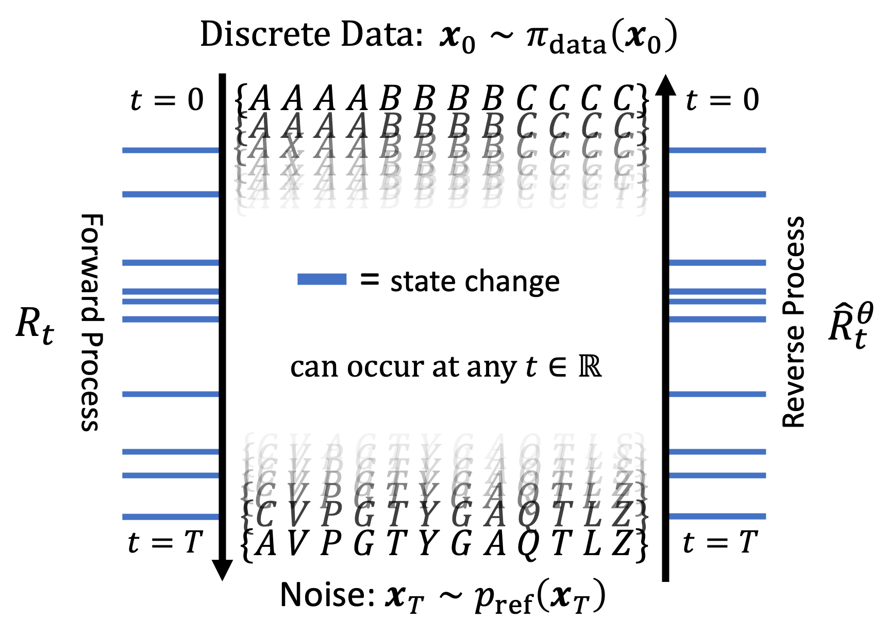

# Continuous-Time Diffusion Models for Discrete Data

[](https://github.com/paulffm/Master-Thesis/blob/master/LICENSE)

This repository serves as an unofficial **PyTorch** reimplementation of the paper [A Continuous Time Framework for Discrete Denoising Models](https://arxiv.org/pdf/2205.14987) (tauLDR) by A. Campbell et al. and first **PyTorch** implementation of the paper [Score-Based Continuous-Time Discrete Diffusion Models](https://openreview.net/pdf?id=BYWWwSY2G5s) (SDDM) by H. Sun et al. As part of my master's thesis, it includes extensions such as the implementation of new **sampling methods** and alternative **loss functions** to enhance the performance and flexibility of both frameworks.

<p align="center">
  
</p>

## Overview

This implementation contains various enhancements and extensions aimed at improving sample quality and flexibility. Below are the key areas where enhancements have been made, along with specific additions:

### Sampling Methods

- **Euler Sampling**: Now available in tauLDR and SDDM.
- **PC-Scheme**: Euler sampling can now be utilized with additional corrector steps.
- **Tau-Leaping**: Now available in tauLDR and SDDM.
- **Midpoint Tau-leaping**: A new additional sampler introduced for enhanced performance.

### Loss Functions

- **Log-likelihood loss**: $L_{\text{ll}}(\theta) = T E_{t\sim \mathcal{U}(0, T) \pi_{\text{data}}(x_0) q_{t|0}(x|x_0)}[ - \log p^{\theta}_{0|t}(x_0|x) ]$
led to increased sample quality.
- **CT-ELBO loss**: The Continuous-time ELBO loss is now compatible with SDDM.
- **Combination of Log-likelihood loss and Categorical Ratio Matching loss**: $L_{\text{CRMll}}(\theta) = L_{\text{CRM}} + \lambda L_{\text{ll}}$ with $\lambda$ between 0.001 and 0.01 led to sample quality improvements.
  
### Networks

- I included many more neural networks as initially proposed, i.e. the score-network from the paper [Dirichlet Diffusion Score Model for Biological Sequence Generation](https://arxiv.org/pdf/2305.10699.pdf)

## Installation

Follow these steps to clone the repository and install the dependencies:

### 1. Clone the repository

Clone the repository using the following command:

```sh
git clone https://github.com/paulffm/Continuous-Time-Diffusion-Models-for-Discrete-Data.git
cd Continuous-Time-Diffusion-Models-for-Discrete-Data
```

### 2. Create a virtual environment

Create a virtual environment to install dependencies in isolation:

```sh
python -m venv venv
source venv/bin/activate  # On Windows use `venv\Scripts\activate`
```

### 3. Install dependencies

Install the necessary dependencies using pip:

```sh
pip install -r requirements.txt
```

## Usage

This implementation provides example scripts for training SDDM and tauLDR models to generate MNIST/maze/synthetic data. In this script you can simply use my provided configs and start training or retraining your models. You just need to set the correct paths in the beginning of the script, i.e.:

```python
def main():

    script_dir = os.path.dirname(os.path.realpath(__file__))
    save_location = os.path.join(script_dir, f"SavedModels/dataset_name/") # Example: "SavedModels/MNIST/"
    save_location_png = os.path.join(save_location, "PNGs/") # save location of generated samples
    dataset_location = os.path.join(script_dir, 'lib/datasets')

    train_resume = False # continue training

    if not train_resume:
        cfg = get_config()
        bookkeeping.save_config(cfg, save_location)

    else:
        model_name = "model_name.pt"
        date = "date_str" 
        config_name = "config_001.yaml"
        config_path = os.path.join(save_location, date, config_name)
        cfg = bookkeeping.load_config(config_path)
```
In addition, there are configuration files (`mnist_generation_example/config/mnist_config`)  provided to simplify the training and sampling process. A configuration file tailored for generating MNIST data with a U-Net includes the following parameters:

| Parameter | Description | Type |
| ------------- | ------------- | ------------- |
| device | Device to be used for training | str |
| distributed | Whether to use distributed training | bool |
| num_gpus | Number of GPUs to use | int |
| loss.name | Name of the loss function | str |
| loss.eps_ratio | Epsilon ratio for numerical stability | float |
| loss.nll_weight | Weight for negative log likelihood loss | int |
| loss.min_time | Minimum time value for loss computation | float |
| training.train_step_name | Name of the training step | str |
| training.n_iters | Number of training iterations | int |
| training.clip_grad | Whether to clip gradients | bool |
| training.grad_norm | Value to normalize gradients | int |
| training.warmup | Number of warmup steps | int |
| training.max_t | Maximum time value for training | int |
| data.name | Name of the dataset | str |
| data.train | Whether to use the training dataset | bool |
| data.download | Whether to download the dataset | bool |
| data.S | Number of possible state values | int |
| data.batch_size | Batch size for training | int |
| data.shuffle | Whether to shuffle the dataset | bool |
| data.image_size | Size of the input image | int |
| data.random_flips | Whether to apply random flips to the input | bool |
| data.use_augm | Whether to use data augmentation | bool |
| data.location | Location of the dataset | str |
| model.name | Name of the model architecture | str |
| model.padding | Whether to use padding in the model | bool |
| model.ema_decay | Exponential moving average decay | float |
| model.ch | Number of channels in the model | int |
| model.num_res_blocks | Number of residual blocks in the model | int |
| model.ch_mult | Channel multipliers for different layers | List[int] |
| model.input_channels | Number of input channels | int |
| model.scale_count_to_put_attn | Scale count to put attention | int |
| model.data_min_max | Min and max values of the data | List[int] |
| model.dropout | Dropout rate in the model | float |
| model.skip_rescale | Whether to skip rescaling | bool |
| model.time_embed_dim | Dimension of the time embedding | int |
| model.time_scale_factor | Time scale factor for embeddings | int |
| model.fix_logistic | Whether to fix logistic | bool |
| model.model_output | Output type of the model | str |
| model.num_heads | Number of attention heads | int |
| model.attn_resolutions | Resolutions for attention | List[int] |
| model.concat_dim | Concatenation dimension | int |
| model.rate_sigma | Sigma value for rate calculation | float |
| model.Q_sigma | Sigma value for Q calculation | float |
| model.time_exp | Exponential value for time calculation | float |
| model.time_base | Base value for time calculation | float |
| optimizer.name | Name of the optimizer | str |
| optimizer.lr | Learning rate for optimization | float |
| saving.checkpoint_freq | Frequency of saving checkpoints | int |
| saving.sample_plot_path | Path for saving sample plots | str |
| sampler.name | Name of the sampler | str |
| sampler.num_steps | Number of steps for sampling | int |
| sampler.min_t | Minimum time value for sampling | float |
| sampler.eps_ratio | Epsilon ratio for numerical stability | float |
| sampler.initial_dist | Initial distribution for sampling | str |
| sampler.num_corrector_steps | Number of corrector steps | int |
| sampler.corrector_step_size_multiplier | Multiplier for corrector step size | float |
| sampler.corrector_entry_time | Entry time for corrector | float |
| sampler.is_ordinal | Whether the data is ordinal | bool |
| sampler.sample_freq | Frequency of sampling | int |

## Note

More information about the maze dataset and sample quality metrics can be found here.

## Reference

```bibtex
@article{campbell2022continuous,
  title={A continuous time framework for discrete denoising models},
  author={Campbell, Andrew and Benton, Joe and De Bortoli, Valentin and Rainforth, Thomas and Deligiannidis, George and Doucet, Arnaud},
  journal={Advances in Neural Information Processing Systems},
  volume={35},
  pages={28266--28279},
  year={2022}
}
@inproceedings{sun2022score,
  title={Score-based Continuous-time Discrete Diffusion Models},
  author={Sun, Haoran and Yu, Lijun and Dai, Bo and Schuurmans, Dale and Dai, Hanjun},
  booktitle={The Eleventh International Conference on Learning Representations},
  year={2022}
}
```
